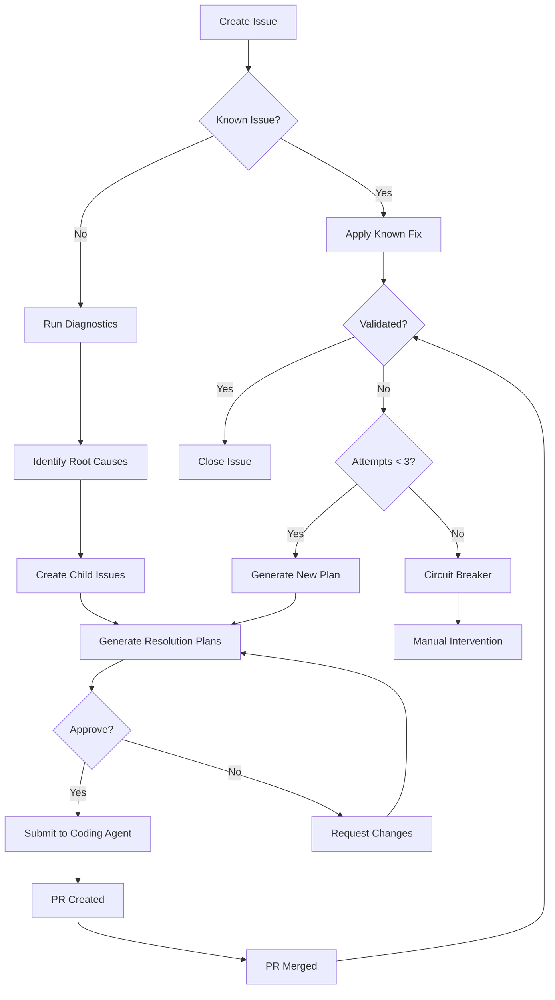

# Troubleshooting Guide: Web-Based Cluster Issue Resolution

This guide explains how to troubleshoot and resolve Kubernetes cluster issues using GitHub Copilot through your web browser - no local IDE or Codespaces required.

## Table of Contents

1. [Overview](#overview)
2. [Quick Start](#quick-start)
3. [Detailed Workflow](#detailed-workflow)
4. [Approval Process](#approval-process)
5. [Circuit Breaker System](#circuit-breaker-system)
6. [Tips and Best Practices](#tips-and-best-practices)
7. [Troubleshooting the Troubleshooter](#troubleshooting-the-troubleshooter)

## Overview

### How It Works

```
You (via GitHub) → Copilot Agents → Diagnosis → Bug Issues → Approval → Coding Agent → Fix
```

**Key Components**:
- **GitHub Issues**: Report problems using structured templates
- **GitHub Copilot Chat**: AI-powered troubleshooting in your browser
- **Self-Hosted Runners**: In-cluster runners with direct Kubernetes access
- **Copilot Agents**: Specialized agents for diagnostics, coordination, and resolution
- **Coding Agent**: Automated PR creation for fixes
- **Knowledge Base**: Searchable history of past issues and solutions

### What You Need

- ✅ Access to github.com/alecsg77/elysium repository
- ✅ Web browser (any modern browser)
- ✅ GitHub account with repository access
- ❌ No local tools required (no kubectl, flux, etc.)
- ❌ No IDE or Codespaces needed

## Quick Start

### For a New Issue

1. **Go to Issues** → https://github.com/alecsg77/elysium/issues
2. **Click "New Issue"**
3. **Choose Template**:
   - 🔍 **Troubleshooting Request** - When you need help investigating
   - 🐛 **Bug Report** - When you know what's broken
   - ✨ **Feature Request** - For enhancements
4. **Fill out the form** with as much detail as possible
5. **Submit** and wait for automated response

### Using GitHub Copilot Chat

1. **On the issue page**, open GitHub Copilot Chat (icon in bottom-right)
2. **Start conversation**:
   ```
   @workspace #file:.github/agents/troubleshooter.agents.md
   Please investigate this issue and run diagnostics
   ```
3. **Copilot will**:
   - Search knowledge base for similar issues
   - Run diagnostic commands
   - Post results as comments
   - Identify root causes
   - Create child bug issues
4. **Review the analysis** and approve resolution plans
5. **Monitor progress** as fixes are implemented

## Detailed Workflow

### Phase 1: Issue Creation

#### Using Troubleshooting Request Template

Best for: "Something's not working, but I don't know why"

**What to include**:
- **Component**: Select from dropdown (Flux, Kubernetes, Networking, etc.)
- **Impact Level**: How severe is it?
- **Symptoms**: What you're observing
- **Affected Services**: Which apps/resources are impacted
- **When Started**: Timeframe or triggering event
- **Recent Changes**: Any changes before the issue
- **Error Messages**: Copy/paste any errors you've seen

**Example**:
```
Component: Application (Specific App)
Impact: High
Symptoms: LibreChat pods keep restarting every 2 minutes
Affected Services: librechat-web, librechat-mongodb
When Started: After deploying new version this morning
Recent Changes: Updated LibreChat image tag to v0.7.0
Error Messages: Pod logs show "MongoDB connection failed"
```

#### Using Bug Report Template

Best for: "I know what's broken and have error details"

**What to include**:
- **Component**: Specific component affected
- **Severity**: Critical → Low
- **Namespace**: Where the problem is
- **Resource Name**: Specific resource (Pod/HelmRelease/etc.)
- **Error Messages**: Full error text
- **Reproduction Steps**: How to reproduce
- **Expected vs Actual**: What should happen vs what's happening

### Phase 2: Automated Diagnostics

After issue creation, invoke troubleshooter:

#### Method 1: GitHub Copilot Chat (Recommended)

1. Open Copilot Chat on the issue page
2. Reference the troubleshooter agent:
   ```
   @workspace #file:.github/agents/troubleshooter.agents.md
   
   Please investigate issue #[number] and provide comprehensive diagnostics
   ```

3. Copilot will:
   - Search knowledge base first
   - If no known fix, run full diagnostics
   - Post results in multiple comments (organized by phase)

#### Method 2: Manual Comment (Alternative)

Comment on the issue:
```
@copilot Please run diagnostics using the troubleshooter agent
```

#### What to Expect

Copilot posts diagnostic results as **sequential comments**:

1. **🏥 Health Check Results**
   - Flux controller status
   - GitRepository sync status
   - Kustomization/HelmRelease status

2. **📦 Resource Status Analysis**
   - Detailed resource conditions
   - Collapsible sections for verbose output

3. **📋 Logs Analysis**
   - Controller logs
   - Application pod logs
   - Errors highlighted

4. **⏱️ Events Timeline**
   - Chronological event list
   - Failure propagation tracking

5. **⚙️ Configuration Review**
   - Current configuration
   - Identified misconfigurations

6. **🎯 Root Cause Analysis**
   - Identified distinct root causes
   - Evidence and confidence levels

### Phase 3: Root Cause Identification

Copilot analyzes diagnostics and posts **Root Cause Summary**:

```markdown
## 🎯 Root Cause Analysis

### Identified Root Causes

#### Root Cause #1: Missing MongoDB Connection Secret
- Component: Application
- Symptoms: LibreChat pods CrashLoopBackOff
- Evidence: Pod logs show "MONGODB_URI environment variable not found"
- Impact: High - Service unavailable
- Confidence: High

#### Root Cause #2: HelmRelease Timeout Too Short
- Component: Flux CD
- Symptoms: HelmRelease install retries exhausted
- Evidence: 8.2GB image takes 8min to pull, timeout is 5min
- Impact: Medium - Deployment blocked
- Confidence: High
```

### Phase 4: Child Issue Creation

For each root cause, Copilot **creates a child bug issue**:

- Uses bug report template with details pre-filled
- Links to parent investigation issue
- Includes semantically complete error context (optimized for coding agent)
- Applies appropriate labels (component, root-cause, severity)

**Parent issue is updated** with task list:

```markdown
## 🐛 Child Issues Created

- [ ] #123 - Missing MongoDB Connection Secret
- [ ] #124 - HelmRelease Timeout Too Short

See root cause analysis in comment above for details.
```

### Phase 5: Resolution Planning

Invoke the issue coordinator agent:

```
@workspace #file:.github/agents/issue-coordinator.agents.md

Please generate resolution plans for all child issues
```

Copilot posts **consolidated review comment** on parent issue:

```markdown
## 📋 Resolution Plans Ready for Review

### Child Issue #123: Missing MongoDB Connection Secret
- **Root Cause**: SealedSecret not created during deployment
- **Resolution**: Create sealed secret with MongoDB URI
- **Risk**: Low
- **Files**: apps/base/ai/librechat-sealed-secret.yaml

### Child Issue #124: HelmRelease Timeout Too Short
- **Root Cause**: Default 5m timeout insufficient for large image
- **Resolution**: Increase timeout to 15m
- **Risk**: Low
- **Files**: apps/base/ai/ollama.yaml

---

## ✋ Approval Required

To proceed with fixes, comment:  `/approve-plan`
```

### Phase 6: Approval

Review the resolution plans carefully:

#### To Approve All Plans
```
/approve-plan
```

#### To Request Changes
```
Please adjust resolution plan for #123:
- Use timeout of 20m instead of 15m
- Add health check configuration
```

#### To Reject
```
/reject

These changes would affect production during business hours.
Please reschedule or propose alternative approach.
```

### Phase 7: Implementation

After approval, coordinator submits requests to **GitHub Copilot coding agent**:

1. **PR Creation**: Coding agent creates PR with fixes
2. **Validation**: After merge, coordinator validates deployment
3. **Status Updates**: Progress posted on child issues

**You'll see**:
```markdown
## 🤖 Resolution Request Submitted

Attempt #1 in progress.

Monitoring for PR creation...

**Circuit Breaker**: 2 attempts remaining
```

### Phase 8: Validation

Coordinator **automatically validates** after PR merge (10-minute window):

✅ **Success**:
```markdown
## ✅ Resolution Validated

- ✅ Flux reconciliation: Ready
- ✅ Pods: 2/2 Running
- ✅ No errors in events

Closing issue. Resolution added to knowledge base.
```

❌ **Failure**:
```markdown
## ❌ Resolution Attempt #1 Failed

Validation failed:
- ❌ Flux status: ReconciliationFailed
- ⚠️ Pod: CrashLoopBackOff

Analyzing failure for retry...

**Circuit Breaker**: 2 attempts remaining
```

## Approval Process

### Why Approval is Required

Prevents unintended automated changes to your cluster. You maintain full control.

### What You're Approving

- Specific files to be modified
- Exact changes to be made
- Implementation order (if dependencies exist)
- Acceptance criteria for validation

### Reviewing Resolution Plans

Check for:
- ✅ **Correctness**: Will this actually fix the root cause?
- ✅ **Safety**: Are there any risks or side effects?
- ✅ **Scope**: Are the file changes appropriate?
- ✅ **Timing**: Is now a good time to apply changes?
- ✅ **Dependencies**: Is the order correct?

### Approval Commands

| Command | Effect |
|---------|--------|
| `/approve-plan` | Approve all resolution plans |
| `/reject` | Reject all plans, request reconsideration |
| Comment with feedback | Request specific changes to plans |

### Single vs Multiple Approvals

**One approval applies to ALL child issues** in the review comment. You don't need to approve each separately.

## Circuit Breaker System

### Purpose

Prevents infinite retry loops when automated fixes fail repeatedly.

### How It Works

1. **Attempt Tracking**: Each resolution attempt is labeled (`resolution-attempt:1`, `resolution-attempt:2`, `resolution-attempt:3`)

2. **Failure Handling**: If resolution fails validation:
   - Attempt counter increments
   - New resolution plan generated (if < 3 attempts)
   - Another approval cycle

3. **Circuit Breaker Trigger**: After 3 failed attempts:
   ```markdown
   ## 🚨 Circuit Breaker Triggered
   
   Maximum attempts reached. Manual intervention required.
   
   ### Attempted Resolutions
   1. Attempt #1: Increased timeout to 15m - Failed (still timing out)
   2. Attempt #2: Increased to 20m - Failed (different error)
   3. Attempt #3: Added init container - Failed (dependency issue)
   
   **Labels Applied**: circuit-breaker:triggered, needs-manual-intervention
   
   To reset: Comment `/reset-attempts`
   ```

4. **Escalation**: Issue tagged for manual review by repository maintainers

### Resetting Circuit Breaker

After manual investigation, if you want to retry:

```
/reset-attempts

Root cause was external mount configuration issue, now fixed manually.
Ready to retry with updated resolution plan.
```

This resets attempt counter and removes circuit breaker label.

### Circuit Breaker States

| Attempts | Status | Action |
|----------|--------|--------|
| 0 | Initial | Generate plan, await approval |
| 1 | First attempt | Submit to coding agent |
| 2 | Second attempt | Adjust plan based on first failure |
| 3 | Final attempt | Last automated try |
| 3+ | Circuit breaker | Manual intervention required |

## Tips and Best Practices

### Reporting Issues

✅ **Do**:
- Provide as much context as possible
- Include exact error messages
- Note when problem started
- List recent changes
- Mention attempted fixes

❌ **Don't**:
- Be vague ("it's broken")
- Assume causes without evidence
- Skip filling out template fields
- Report multiple unrelated issues in one

### During Investigation

✅ **Do**:
- Be patient (diagnostics take 2-5 minutes)
- Review diagnostic reports carefully
- Ask Copilot for clarification if needed
- Check if similar issues exist

❌ **Don't**:
- Make manual changes during investigation
- Submit duplicate troubleshooting requests
- Expect instant fixes for complex issues

### Approving Plans

✅ **Do**:
- Read resolution plans completely
- Verify changes match root cause
- Consider impact and timing
- Ask questions if unsure

❌ **Don't**:
- Auto-approve without review
- Approve changes you don't understand
- Skip reading the proposed changes

### After Resolution

✅ **Do**:
- Verify the fix worked for you
- Close issue if satisfied
- Provide feedback if issues persist
- Check knowledge base was updated

❌ **Don't**:
- Reopen closed issues for new problems
- Forget to validate in your environment

## Troubleshooting the Troubleshooter

### Issue: No Response from Copilot

**Possible Causes**:
1. Copilot Chat not enabled for repository
2. Agent reference incorrect
3. Insufficient permissions

**Solutions**:
- Ensure you're using GitHub Copilot Chat in browser
- Reference agent exactly: `@workspace #file:.github/agents/troubleshooter.agents.md`
- Check you have write access to repository

### Issue: Diagnostics Incomplete

**Possible Causes**:
1. Insufficient information in issue
2. Resources no longer exist
3. Transient cluster issue

**Solutions**:
- Provide more context in issue description
- Check if issue still persists
- Ask Copilot to re-run specific diagnostic phase

### Issue: No Child Issues Created

**Possible Causes**:
1. No distinct root causes identified
2. Issue is symptom of another problem
3. Need more diagnostics

**Solutions**:
- Review root cause analysis comment
- Ask Copilot to clarify analysis
- Provide additional information

### Issue: Resolution Plan Doesn't Make Sense

**Possible Causes**:
1. Misunderstood root cause
2. Incomplete context
3. Coordinator agent error

**Solutions**:
- Request changes in approval comment
- Provide additional context
- Ask coordinator to regenerate plan

### Issue: Coding Agent PR Failed

**Possible Causes**:
1. Merge conflicts
2. CI validation failure
3. Incorrect changes

**Solutions**:
- Circuit breaker will retry (up to 3 attempts)
- Review PR for errors
- Provide feedback to improve next attempt

### Issue: Validation Keeps Failing

**Possible Causes**:
1. Wrong root cause identified
2. Additional issues discovered
3. External dependencies

**Solutions**:
- Wait for circuit breaker (3 attempts)
- Review all failed attempts for patterns
- Manual investigation may be needed

### Getting Help

If automated troubleshooting isn't working:

1. **Check Documentation**: Review this guide and `.github/copilot-instructions.md`
2. **Search Past Issues**: Look for similar problems in closed issues
3. **Ask in Discussion**: Use GitHub Discussions for questions
4. **Manual Intervention**: Sometimes manual fixes are fastest

## Advanced Usage

### Custom Diagnostic Commands

You can ask Copilot to run specific checks:

```
@workspace #file:.github/agents/troubleshooter.agents.md

Please check:
- Flux reconciliation status for ai namespace
- Pod logs for librechat-web
- Recent events in the ai namespace
- HelmRelease status for all AI apps
```

### Searching Knowledge Base

Before creating an issue:

```
@workspace #file:.github/agents/knowledge-base.agents.md

Has anyone seen "MongoDB connection failed" errors with LibreChat before?
```

### Requesting Specific Resolution

In approval comment, you can suggest specific fixes:

```
The resolution plan looks good, but please also:
- Add resource limits to the pod spec
- Include a liveness probe
- Update the documentation

/approve-plan with these additions
```

### Bypassing Approval (Not Recommended)

For low-risk, urgent fixes, you might request:

```
@workspace #file:.github/agents/issue-coordinator.agents.md

This is urgent and low-risk. Please submit to coding agent immediately after generating plan.
```

⚠️ Use sparingly - you lose review opportunity.

## Workflow Diagram



---

## Summary

**Web-based troubleshooting workflow**:
1. Create issue with template
2. Copilot runs diagnostics
3. Root causes identified
4. Review and approve plans
5. Automated PR implementation
6. Validation and closure
7. Knowledge base updated

**No local tools required** - everything happens in your browser through GitHub.

For more details, see:
- `.github/copilot-instructions.md` - Complete system documentation
- `.github/KNOWN_ISSUES.md` - Past issue resolutions
- `.github/instructions/flux.instructions.md` - Flux-specific patterns
