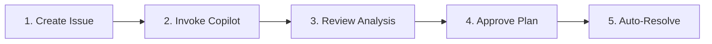

# Web Troubleshooting Quick Reference

**One-page guide for cluster issue resolution via GitHub web interface**

## 🚀 Quick Start (5 Steps)



### 1. Create Issue
🔗 https://github.com/alecsg77/elysium/issues/new/choose

**Choose template:**
- 🐛 **Bug Report** - Known issue with clear symptoms
- 🔍 **Troubleshooting Request** - Need investigation

**Provide:**
- Component (Flux/Kubernetes/Application/Network)
- Namespace and resource name
- Error messages (exact text)
- Recent changes

### 2. Invoke Copilot
**In GitHub Copilot Chat on issue page:**

```
@workspace #file:.github/agents/troubleshooter.agents.md
Please investigate this issue and run diagnostics
```

**Wait 2-5 minutes** for diagnostic collection.

### 3. Review Analysis
Copilot posts **5 diagnostic phases**:
1. ✅ Health Check - System status
2. 📊 Resource Status - Kubernetes/Flux conditions
3. 📝 Logs - Error extraction
4. 📅 Events - Timeline
5. ⚙️ Configuration - Manifests

Then **creates child bugs** (one per root cause) with:
- Detailed description
- Root cause analysis
- Proposed resolution plan

### 4. Approve Plan
**Review consolidated comment** with all resolution plans.

**Approve:**
```
/approve-plan
```

**Reject (request changes):**
```
/reject
[Explain what needs adjustment]
```

### 5. Auto-Resolve
- ✅ Coding agent creates PRs
- ✅ Coordinator validates deployments (10-min window)
- ✅ Issues auto-close on success
- ✅ Knowledge base auto-updates
- ⚠️ Retry on failure (max 3 attempts)

---

## 📋 Common Commands

| Command | Purpose |
|---------|---------|
| `/approve-plan` | Approve all resolution plans |
| `/reject` | Reject plans, request alternative |
| `/reset-attempts` | Reset circuit breaker after manual fix |

---

## 🔍 Knowledge Base Search

**Before creating issue, search for known fixes:**

```bash
# By component
grep -A 20 "## Component: Flux CD" .github/KNOWN_ISSUES.md

# By error message
grep -i "timeout\|crashloop\|imagepull" .github/KNOWN_ISSUES.md

# By resource
grep -A 20 "HelmRelease\|Pod\|Deployment" .github/KNOWN_ISSUES.md
```

**Or use Copilot:**
```
@workspace #file:.github/agents/knowledge-base.agents.md
Search for issues with "HelmRelease timeout"
```

---

## ⚡ Diagnostic Phases Explained

### Phase 1: Health Check
- Flux controller status
- Git repository sync
- Reconciliation state
- Overall cluster health

### Phase 2: Resource Status
- Kustomization/HelmRelease conditions
- Deployment/StatefulSet readiness
- Pod phase and container states
- Inventory of managed resources

### Phase 3: Logs
- Controller logs with error extraction
- Application container logs
- Init container failures
- Previous container logs (if restarted)

### Phase 4: Events
- Kubernetes event timeline
- Flux reconciliation events
- Error and warning events
- Sorted by timestamp

### Phase 5: Configuration
- Resource manifests (YAML)
- ConfigMap/Secret values
- Variable substitution sources
- HelmRelease values

---

## 🔄 Circuit Breaker System

| Attempts | Status | Action |
|----------|--------|--------|
| 1️⃣ | First try | Initial resolution plan |
| 2️⃣ | Retry | Adjusted plan based on failure |
| 3️⃣ | Final | Last automated attempt |
| 🛑 | **Breaker** | Manual intervention required |

**After 3 failures:**
- Label: `circuit-breaker:triggered`
- Label: `needs-manual-intervention`
- Manual debugging required

**To reset:**
```
/reset-attempts
Manually fixed [issue]. Ready to retry.
```

---

## 🎯 Common Issue Patterns

### Flux HelmRelease Timeout
**Symptom:** `install retries exhausted`  
**Fix:** Increase `spec.timeout` in HelmRelease  
**File:** `apps/base/<app>/release.yaml`

### Pod CrashLoopBackOff (Missing ConfigMap)
**Symptom:** `CreateContainerConfigError`  
**Fix:** Create missing ConfigMap  
**File:** `apps/base/<app>/configmap.yaml` or `clusters/kyrion/config-map.yaml`

### ImagePullBackOff
**Symptom:** `ErrImagePull`  
**Fix:** Verify image exists, check pull secrets, test registry access  
**File:** `apps/base/<app>/release.yaml` (image tag)

### Variable Substitution Failed
**Symptom:** `failed to substitute variables`  
**Fix:** Create missing ConfigMap/Secret in `clusters/kyrion/`  
**File:** `clusters/kyrion/config-map.yaml` or `sealed-secrets.yaml`

### Dependency Not Ready
**Symptom:** Kustomization waiting on `dependsOn`  
**Fix:** Fix upstream dependency first  
**File:** Check dependency Kustomization path

### OOMKilled (Out of Memory)
**Symptom:** Pod restarting with `OOMKilled`  
**Fix:** Increase `resources.limits.memory`  
**File:** `apps/base/<app>/release.yaml` or `apps/kyrion/<app>-values-patch.yaml`

### SealedSecret Not Decrypting
**Symptom:** Secret not created, sealed-secrets controller errors  
**Fix:** Recreate with correct namespace, verify sealed-secrets controller running  
**File:** `apps/base/<app>/*-sealed-secret.yaml`

---

## 📚 Documentation Links

| Document | Purpose |
|----------|---------|
| [TROUBLESHOOTING.md](.github/TROUBLESHOOTING.md) | Complete workflow guide |
| [KNOWN_ISSUES.md](.github/KNOWN_ISSUES.md) | Searchable issue database |
| [copilot-instructions.md](.github/copilot-instructions.md) | Full system documentation |
| [WEB_TROUBLESHOOTING_IMPLEMENTATION.md](.github/WEB_TROUBLESHOOTING_IMPLEMENTATION.md) | Implementation details |

---

## 🤖 Agent Reference

| Agent | File | Purpose |
|-------|------|---------|
| **Troubleshooter** | `.github/agents/troubleshooter.agents.md` | Diagnostic collection |
| **Issue Coordinator** | `.github/agents/issue-coordinator.agents.md` | Resolution orchestration |
| **Knowledge Base** | `.github/agents/knowledge-base.agents.md` | Search past issues |

---

## ✅ Best Practices

### Reporting Issues
- ✅ Include exact error messages (copy-paste)
- ✅ Specify when problem started
- ✅ List recent changes (commits, deployments)
- ✅ Note attempted fixes
- ❌ Avoid vague descriptions ("it's broken")
- ❌ Don't report multiple unrelated issues in one

### During Investigation
- ✅ Review all diagnostic phases carefully
- ✅ Check knowledge base for similar issues first
- ✅ Be patient (diagnostics take 2-5 minutes)
- ❌ Don't make manual changes during investigation
- ❌ Don't duplicate requests if agent is working

### Approving Plans
- ✅ Read full resolution plans before approving
- ✅ Verify changes address root cause
- ✅ Consider impact and timing
- ✅ Ask questions if unclear
- ❌ Don't auto-approve without review
- ❌ Don't approve changes you don't understand

### After Resolution
- ✅ Verify application working end-to-end
- ✅ Check for cascading issues
- ✅ Close issue with `status:resolved` label (for KB update)
- ✅ Document any manual steps taken

---

## 🆘 Troubleshooting the Troubleshooter

**Agent not responding?**
- Check runner status: `kubectl get pods -n arc-runners`
- Verify Copilot agent enabled on repository
- Check GitHub Actions runner logs

**Diagnostics incomplete?**
- Check for timeout (increase if needed)
- Verify runner has cluster access
- Check runner ServiceAccount permissions

**Circuit breaker triggered prematurely?**
- Review resolution attempts for patterns
- Consider manual debugging for complex issues
- Reset and provide more context

**Knowledge base search not working?**
- Verify KNOWN_ISSUES.md exists
- Check issue labels (`status:resolved` required)
- Try alternative search terms

---

## 📞 Support

**Questions?** Open discussion: https://github.com/alecsg77/elysium/discussions

**Bug in troubleshooting system?** Create issue with label `troubleshooting-system`

**Need help?** Tag `@alecsg77` in issue comments

---

**Last Updated:** 2025-01-24  
**Version:** 1.0
