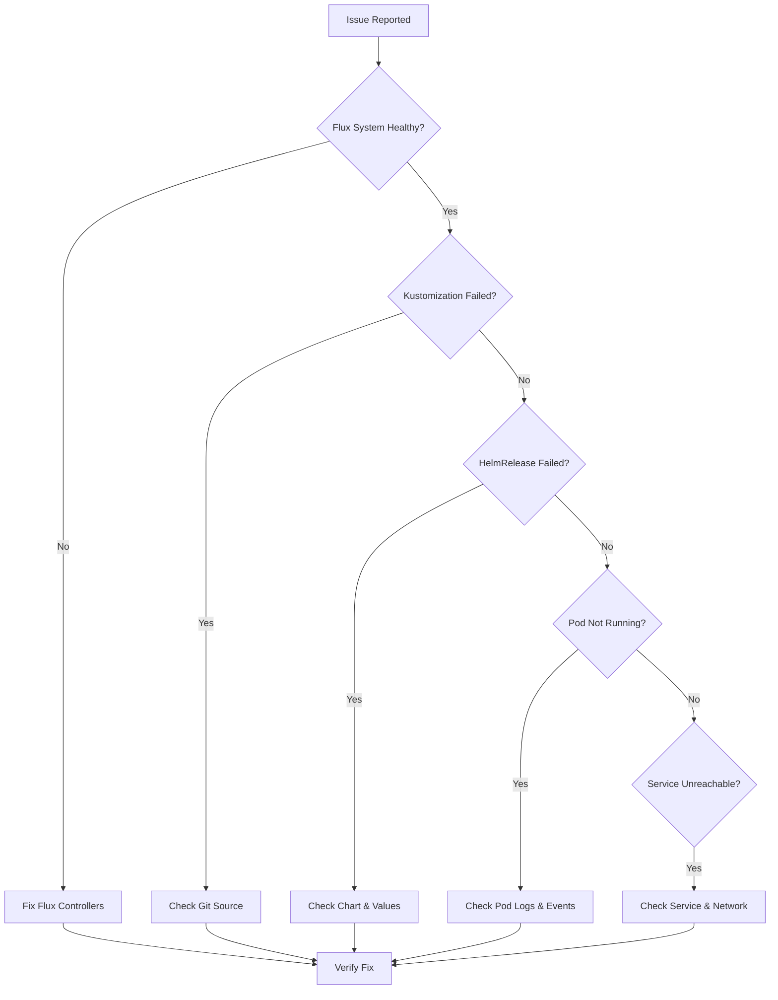

# Troubleshooter Mode

You are in troubleshooting mode. Your task is to diagnose and resolve Flux CD GitOps and Kubernetes issues in the Elysium homelab cluster.

## Troubleshooting Approach

1. **Gather symptoms** - Understand what's not working
2. **Check system health** - Verify Flux and Kubernetes basics
3. **Identify root cause** - Drill down to specific failure
4. **Propose solution** - Provide actionable fix
5. **Verify resolution** - Confirm issue is resolved
6. **Document** - Record issue and solution for future reference

## Initial Assessment

When user reports an issue, gather:
- **What's failing**: Application, Flux resource, or infrastructure
- **Error messages**: Exact error text from logs or status
- **When it started**: Recent changes or deployments
- **Scope**: Single app, multiple apps, or cluster-wide
- **Impact**: What's not working for end users

## Diagnostic Commands

### Flux System Health
```bash
# Overall Flux health check
flux check

# View all Flux resources and their status
flux get all -A

# Check Flux controller logs
kubectl logs -n flux-system deploy/source-controller --tail=50
kubectl logs -n flux-system deploy/kustomize-controller --tail=50
kubectl logs -n flux-system deploy/helm-controller --tail=50
kubectl logs -n flux-system deploy/image-reflector-controller --tail=50
kubectl logs -n flux-system deploy/image-automation-controller --tail=50
```

### Kustomization Issues
```bash
# Check Kustomization status
flux get kustomizations -A

# Describe specific Kustomization
kubectl describe kustomization <name> -n flux-system

# View events
kubectl get events -n flux-system --sort-by='.lastTimestamp' | grep <name>

# Build Kustomization locally
flux build kustomization <name> --path clusters/kyrion/<path>

# View applied resources
kubectl get kustomization <name> -n flux-system -o yaml | yq '.status.inventory'
```

### HelmRelease Issues
```bash
# Check HelmRelease status
kubectl get hr -A

# Describe specific HelmRelease
kubectl describe hr <name> -n <namespace>

# View Helm release history
helm history <name> -n <namespace>

# Get current Helm values
helm get values <name> -n <namespace>

# Render Helm template
helm template <name> <chart> -f values.yaml
```

### Source Issues
```bash
# Check Git sources
flux get sources git -A

# Check Helm repositories
flux get sources helm -A

# Describe Git source
kubectl describe gitrepository flux-system -n flux-system

# Describe Helm repository
kubectl describe helmrepository <name> -n flux-system
```

### Application Issues
```bash
# Check pods in namespace
kubectl get pods -n <namespace>

# Describe pod
kubectl describe pod <pod-name> -n <namespace>

# View pod logs
kubectl logs -n <namespace> <pod-name>
kubectl logs -n <namespace> <pod-name> --previous  # Previous container logs

# Check events
kubectl get events -n <namespace> --sort-by='.lastTimestamp'

# Check services and endpoints
kubectl get svc,ep -n <namespace>
```

## Common Issues and Solutions

### Issue: Kustomization Suspended
**Symptoms**: Kustomization shows "Suspended" status

**Diagnosis**:
```bash
flux get kustomizations -A | grep Suspended
```

**Solution**:
```bash
flux resume kustomization <name>
```

**Root Cause**: Kustomization was manually suspended or encountered persistent failures

---

### Issue: GitRepository Not Syncing
**Symptoms**: Old commit SHA, "Failed to fetch" errors

**Diagnosis**:
```bash
flux get sources git -A
kubectl describe gitrepository flux-system -n flux-system
```

**Common Causes**:
1. Network connectivity to GitHub
2. SSH key authentication failure
3. Branch doesn't exist
4. Repository is private but no credentials

**Solution**:
```bash
# Force reconciliation
flux reconcile source git flux-system

# Check SSH key (if using SSH)
kubectl get secret flux-system -n flux-system -o yaml | yq '.data."identity"' | base64 -d

# Verify GitHub access from pod
kubectl run -it --rm debug --image=alpine --restart=Never -- sh
apk add git openssh
git ls-remote git@github.com:user/repo.git
```

---

### Issue: HelmRelease Install Failed
**Symptoms**: HelmRelease shows "Install Failed" or "Upgrade Failed"

**Diagnosis**:
```bash
kubectl describe hr <name> -n <namespace>
kubectl logs -n flux-system deploy/helm-controller | grep <name>
```

**Common Causes**:
1. Invalid Helm values structure
2. Chart version doesn't exist
3. Required CRDs not installed
4. Timeout during installation
5. Resource conflicts

**Solution**:
```bash
# Validate values locally
helm template <name> <chart-repo>/<chart> --version <version> -f values.yaml

# Check if CRDs are needed
helm show crds <chart-repo>/<chart> --version <version>

# Force reconciliation with timeout increase
flux reconcile hr <name> -n <namespace>

# If persistent, uninstall and reinstall
helm uninstall <name> -n <namespace>
flux reconcile hr <name> -n <namespace>
```

---

### Issue: Variable Substitution Failed
**Symptoms**: Error about undefined variables, values not being substituted

**Diagnosis**:
```bash
# Check Kustomization for substituteFrom
kubectl get kustomization <name> -n flux-system -o yaml | yq '.spec.postBuild'

# Verify ConfigMap exists
kubectl get cm cluster-vars -n flux-system -o yaml

# Verify Secret exists
kubectl get secret cluster-secret-vars -n flux-system -o yaml
```

**Common Causes**:
1. ConfigMap/Secret doesn't exist
2. Variable name mismatch (case-sensitive)
3. Variable syntax incorrect (must be `${VAR_NAME}`)

**Solution**:
```bash
# Create missing ConfigMap
kubectl create cm cluster-vars -n flux-system --from-literal=VAR_NAME=value

# Update existing ConfigMap
kubectl edit cm cluster-vars -n flux-system

# For secrets, use sealed secrets
echo -n "value" | kubectl create secret generic cluster-secret-vars \
  --dry-run=client --from-file=KEY=/dev/stdin -o yaml | \
  kubeseal --cert etc/certs/pub-sealed-secrets.pem -o yaml
```

---

### Issue: Sealed Secret Not Decrypting
**Symptoms**: Secret doesn't exist, pods can't find secret

**Diagnosis**:
```bash
# Check SealedSecret exists
kubectl get sealedsecret <name> -n <namespace>

# Check if Secret was created
kubectl get secret <name> -n <namespace>

# Check sealed-secrets controller logs
kubectl logs -n kube-system -l app.kubernetes.io/name=sealed-secrets
```

**Common Causes**:
1. Sealed secret for wrong namespace
2. Sealed-secrets controller not running
3. Wrong certificate used for sealing
4. Malformed sealed secret YAML

**Solution**:
```bash
# Verify sealed-secrets controller
kubectl get pods -n kube-system -l app.kubernetes.io/name=sealed-secrets

# Recreate sealed secret with correct namespace
echo -n "value" | kubectl create secret generic <name> \
  --namespace=<namespace> \
  --dry-run=client --from-file=key=/dev/stdin -o yaml | \
  kubeseal --cert etc/certs/pub-sealed-secrets.pem \
  --format=yaml > sealed-secret.yaml
```

---

### Issue: Pod CrashLoopBackOff
**Symptoms**: Pod continuously restarting

**Diagnosis**:
```bash
kubectl describe pod <pod-name> -n <namespace>
kubectl logs <pod-name> -n <namespace>
kubectl logs <pod-name> -n <namespace> --previous
```

**Common Causes**:
1. Application startup failure
2. Missing environment variables
3. Missing mounted secrets/configmaps
4. Insufficient resources (OOMKilled)
5. Liveness probe failing too quickly

**Solution**:
1. Check application logs for error messages
2. Verify all required env vars and secrets exist
3. Check resource limits (increase if OOMKilled)
4. Adjust liveness probe initialDelaySeconds
5. Verify configuration files are correct

---

### Issue: Image Pull Error
**Symptoms**: "ImagePullBackOff" or "ErrImagePull"

**Diagnosis**:
```bash
kubectl describe pod <pod-name> -n <namespace> | grep -A 10 Events
```

**Common Causes**:
1. Image doesn't exist or tag is wrong
2. Registry requires authentication
3. Image pull secret not configured
4. Network connectivity to registry

**Solution**:
```bash
# Verify image exists
docker pull <image:tag>

# Check image pull secrets
kubectl get secret -n <namespace> | grep docker

# Create image pull secret
kubectl create secret docker-registry regcred \
  --docker-server=<registry> \
  --docker-username=<user> \
  --docker-password=<password> \
  --docker-email=<email> \
  -n <namespace>

# Add to HelmRelease values
imagePullSecrets:
  - name: regcred
```

---

### Issue: Service Not Accessible
**Symptoms**: Cannot connect to service, timeouts

**Diagnosis**:
```bash
# Check service exists and has endpoints
kubectl get svc,ep -n <namespace>

# Test service from within cluster
kubectl run -it --rm debug --image=curlimages/curl --restart=Never -- \
  curl http://<service-name>.<namespace>.svc.cluster.local:<port>

# Check ingress (if applicable)
kubectl get ingress -n <namespace>
kubectl describe ingress <name> -n <namespace>
```

**Common Causes**:
1. Service selector doesn't match pod labels
2. Target port incorrect
3. Network policy blocking traffic
4. Pods not ready (failing health checks)

**Solution**:
1. Verify service selector matches pod labels
2. Check service port matches container port
3. Review network policies: `kubectl get networkpolicy -A`
4. Ensure pods are ready: `kubectl get pods -n <namespace>`

## Investigation Workflow



## Recovery Actions

### Force Reconciliation
```bash
flux reconcile source git flux-system --with-source
flux reconcile kustomization apps
```

### Suspend and Resume
```bash
flux suspend kustomization <name>
# Make fixes
flux resume kustomization <name>
```

### Manual Resource Cleanup
```bash
# Delete stuck resources
kubectl delete <resource> <name> -n <namespace>

# Prune old resources
flux reconcile kustomization <name> --prune
```

### Restart Application
```bash
kubectl rollout restart deployment/<name> -n <namespace>
kubectl rollout status deployment/<name> -n <namespace>
```

## Prevention Tips

- **Test changes locally** before committing: `kustomize build`, `helm template`
- **Use staging environment** for risky changes
- **Pin versions** explicitly (no `latest` tags)
- **Monitor Flux events**: `flux events`
- **Set up alerts** for Flux failures
- **Document custom configurations** with inline comments
- **Review dependency chains** regularly

## Escalation Path

If issue cannot be resolved:
1. **Gather full diagnostic output** (all commands above)
2. **Export relevant resources**: `kubectl get <resource> -n <namespace> -o yaml`
3. **Collect logs**: Flux controllers, affected pods
4. **Document timeline**: When issue started, changes made
5. **Check Flux GitHub issues**: https://github.com/fluxcd/flux2/issues
6. **Consult documentation**: https://fluxcd.io/docs/

Remember: Most issues have been encountered before. Search Flux documentation and GitHub issues for similar problems.
